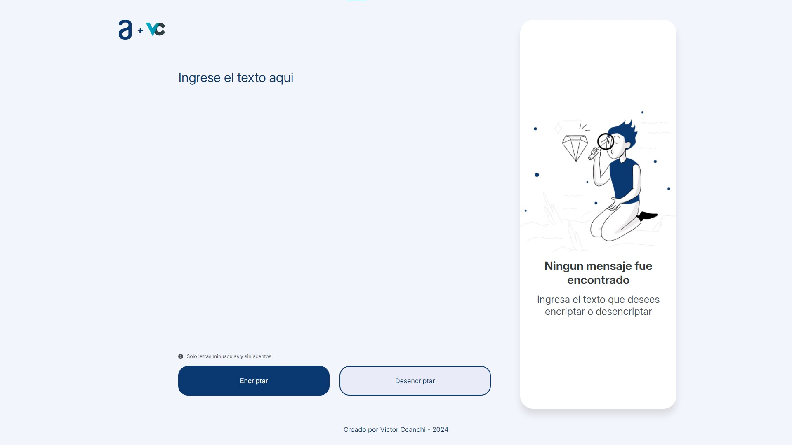
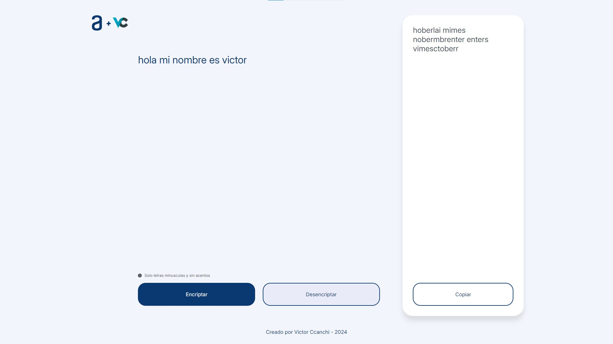

# Proyecto de Encriptación de Textos

## Descripción

Una aplicación que encripta y desencripta textos utilizando un conjunto específico de reglas de encriptación. Esta aplicación permite a los usuarios intercambiar mensajes secretos con otras personas que conozcan el secreto de la encriptación utilizada.

## Características

- Encripta textos utilizando reglas específicas.
- Desencripta textos encriptados.
- Funciona solo con letras minúsculas.
- No permite letras con acentos ni caracteres especiales.
- Interfaz de usuario para insertar texto y elegir entre encriptar o desencriptar.
- Muestra el resultado en la pantalla.
- Botón para copiar el texto encriptado/desencriptado al portapapeles.

## Demo

Puedes ver el funcionamiento del proyecto visitando la siguiente URL: [Enlace a la Demo](https://victorwcv.github.io/encriptador-de-texto/)

En esta demo, podrás:
- Encriptar textos ingresando palabras en el campo de texto y seleccionando la opción de encriptar.
- Desencriptar textos ingresando palabras encriptadas en el campo de texto y seleccionando la opción de desencriptar.
- Copiar el texto encriptado/desencriptado al portapapeles con un solo clic.


## Instalación

1. Clona este repositorio:
    ```sh
    git clone https://github.com/victorwcv/encriptador-de-texto
    ```
2. Navega al directorio del proyecto:
    ```sh
    cd proyecto-encriptacion
    ```

## Uso

1. Abre el archivo `index.html` en tu navegador.

## Capturas de Pantalla

### Página Principal


### Texto Encriptado


### Texto Desencriptado


## Contribución

1. Haz un fork del proyecto.
2. Crea una nueva rama (`git checkout -b mejora-feature`).
3. Realiza tus cambios y haz commit (`git commit -am 'Añadir nueva feature'`).
4. Sube tus cambios (`git push origin mejora-feature`).
5. Crea un Pull Request.

## Licencia

Este proyecto está licenciado bajo la Licencia MIT - mira el archivo [LICENSE](LICENSE) para más detalles.

## Contacto

- Autor: Victor Ccanchi
- Email: vitorwccv@gmail.com
- LinkedIn: [www.linkedin.com/in/victor-ccanchi](https://www.linkedin.com/in/victor-ccanchi/)

---


